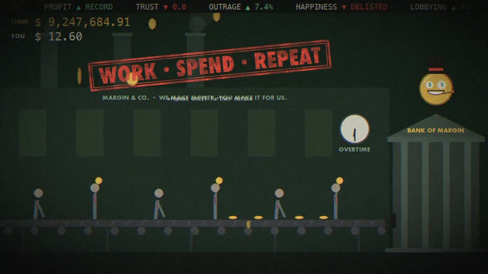
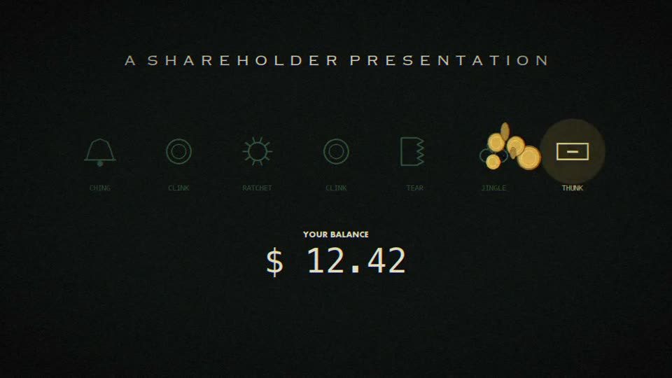
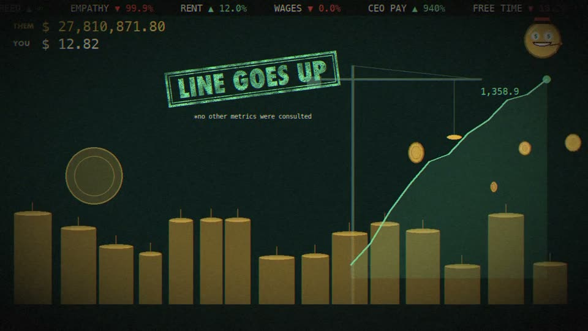
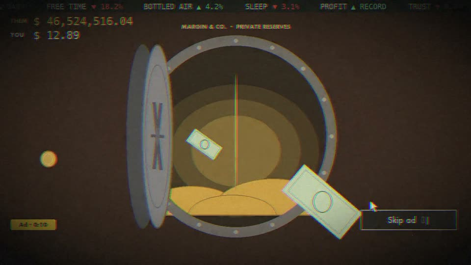
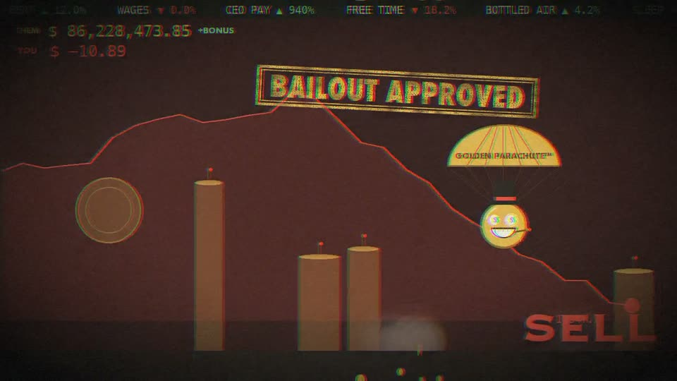
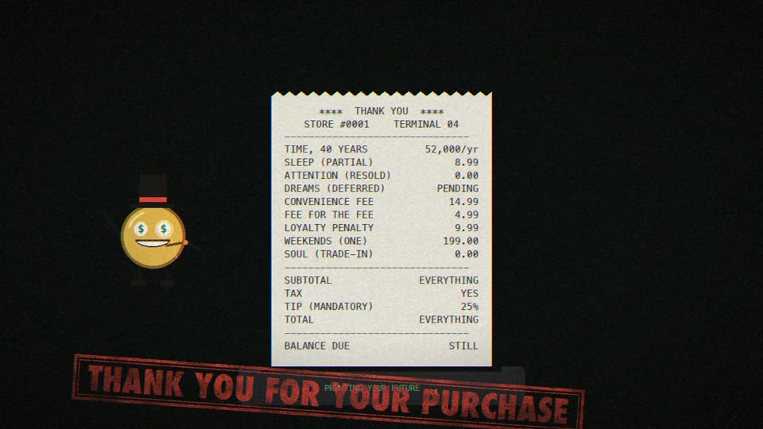

# money-mv

一个用 Python 程序化生成的讽刺风格音乐录像（MV）渲染器。灵感来自 Pink Floyd 的《Money》（1973）：7/4 拍的律动、收银机音效，以及对金钱与资本的讽刺。

所有画面都由代码逐帧绘制（numpy + Pillow），通过管道交给 ffmpeg 编码成 MP4。项目自带一首**原创合成配乐**，不需要任何外部素材就能渲染出完整的 90 秒视频。你也可以用自己合法拥有的音频和歌词文件来渲染。



**成品视频**：[下载 money-mv.mp4](https://github.com/roy2100/money-mv/releases/download/v1.0.0/money-mv.mp4)（90 秒，1280x720，原创配乐版，见 [Release v1.0.0](https://github.com/roy2100/money-mv/releases/tag/v1.0.0)）

## 画面

视频分成几个段落，每段一个场景，连起来是一个关于钱的小故事：

| 段落 | 场景 |
|---|---|
| intro | 收银机的七种声音依次亮起：叮、硬币、棘轮、撕纸、抽屉。底下是「YOUR BALANCE」 |
| groove | **流水线工厂**：系领带的工人随节拍把硬币放上传送带，硬币被送进「BANK OF MARGIN」，吉祥物 Mr. Margin 站在银行屋顶 |
| rise | **硬币摩天楼**：硬币堆成的天际线随股价和频谱长高，吊车、天线跟着节拍闪 |
| solo | **金库大门**缓缓打开，旋转金币和钞票隧道从里面飞出来；右下角是一个永远跳不过去的广告 |
| crash | **天际线倒塌**：股价暴跌，Mr. Margin 挂着黄金降落伞（GOLDEN PARACHUTE™）飘走 |
| outro | 一张小票打印出来：时间 40 年、睡眠（部分）、灵魂（以旧换新）……合计：EVERYTHING |

贯穿全片的讽刺元素：
- **橡皮图章**：口号像盖章一样砸下来，下面跟一行小字条款，例如 "WORK · SPEND · REPEAT"、"BAILOUT APPROVED"。
- **THEM / YOU 计数器**：THEM 涨到上亿，YOU 一直原地踏步，暴跌时还会变成负数。
- **行情滚动条**：GREED ▲ ∞、EMPATHY ▼ 99.9% 之类。

画面质感模仿印刷品：有胶片颗粒，鼓点落下时会出现套色错位，图章盖下时画面会震一下。

<p>





</p>

## 环境要求

- **macOS**：脚本使用系统自带字体（`/System/Library/Fonts/...`，包括 Copperplate、Futura、Menlo 等）。在其他系统上运行，需要修改 `render_mv.py` 顶部的字体路径。
- Python 3.10+
- [ffmpeg](https://ffmpeg.org/)（`brew install ffmpeg`）

可选，仅用于歌词自动对齐：
- [whisper.cpp](https://github.com/ggml-org/whisper.cpp)（`brew install whisper-cpp`），外加一个模型文件，默认路径是 `~/whisper-models/ggml-large-v3-turbo.bin`。
- [demucs](https://github.com/adefossez/demucs)，用来分离人声。

## 安装

```bash
git clone https://github.com/roy2100/money-mv.git
cd money-mv
python3 -m venv .venv
.venv/bin/pip install -r requirements.txt
```

## 使用

### 1. 用原创配乐渲染（不需要任何素材）

```bash
.venv/bin/python render_mv.py                  # 完整 90 秒 → out/money_mv.mp4
.venv/bin/python render_mv.py --preview 12     # 只渲染前 12 秒，用来快速预览
```

配乐会同时导出为 `out/money_mv_soundtrack.wav`。完整渲染在 Apple Silicon 上大约需要 45 秒。

### 2. 用你自己的音频渲染

画面会跟着音频走：程序会自动追踪节拍（能处理速度漂移），鼓点和高频事件会触发硬币雨、闪光等效果。你需要用 `--sections` 告诉它每一段从什么时候开始：

```bash
.venv/bin/python render_mv.py --audio your_song.m4a \
  --sections "0:00=intro,0:09.3=groove,1:42=rise,2:52.8=solo,3:31=crash,4:04=outro/4" \
  --out out/my_mv.mp4
```

- 可用的段落名：`intro`、`groove`、`rise`、`solo`、`crash`、`outro`。
- 在段落名后加 `/N` 可以指定拍号，例如 `outro/4`。
- 不传 `--sections` 时，按歌曲时长的固定比例自动分段。

### 3. 加歌词

歌词需要你自己提供带时间戳的 `.lrc` 文件。歌词会以「勒索信」拼贴风格呈现：每个词像从不同的杂志上剪下来，随节奏逐个弹出。

```bash
.venv/bin/python render_mv.py --audio your_song.m4a --lyrics your_song.lrc --sections "..."
```

如果 LRC 对应的是另一个版本（比如现场版），可以用 `--lyrics-offset` 整体或分段平移时间：

```bash
--lyrics-offset "-14.9"                     # 整体提前 14.9 秒
--lyrics-offset "0:00=-14.87,7:00=-247.52"  # 原时间 0:00 之后的句子提前 14.87 秒，7:00 之后的提前 247.52 秒
```

### 4. 歌词自动对齐（可选）

`align_lyrics.py` 会把 LRC 重新对齐到你的录音上，输出一份新的 LRC：

```bash
# 先分离出人声（需要 demucs）
.venv/bin/pip install demucs soundfile
.venv/bin/python -m demucs --two-stems vocals -d mps -o out/stems your_song.m4a

# 再对齐
.venv/bin/python align_lyrics.py your_song.m4a your_song.lrc out/aligned.lrc \
  --offset "0:00=-14.87,7:00=-247.52" \
  --chunks "0:20-2:00,3:25-4:45" \
  --vocals out/stems/htdemucs/your_song/vocals.wav
```

工作原理：
1. 用本地 whisper.cpp 对原曲混音和分离出的人声各转写几遍（包括带 DTW 时间戳的版本），把所有识别结果汇总。单次转写在有伴奏的音乐上很不稳定。
2. 把整份歌词和汇总后的识别结果做一次全局序列对齐（Needleman-Wunsch），确定每句歌词对应录音里的哪一段。
3. 每句歌词的出现时间，取它所在的那段人声实际开始的时间。人声的起止从分离出的人声音轨按音量判断。

对齐完成后，脚本会打印每句的匹配覆盖率，方便你检查哪几句可能不准。

## 常用参数

| 参数 | 说明 |
|---|---|
| `--audio` | 用自己的音频代替原创配乐 |
| `--sections` | 段落起始时间，见上文 |
| `--lyrics` / `--lyrics-offset` | LRC 歌词文件，以及时间平移 |
| `--preview N` | 只渲染前 N 秒 |
| `--crf N` | x264 画质，数值越大文件越小，默认 23 |
| `--bpm` | 原创配乐的速度，默认 120 |
| `--seed` | 随机种子，影响配乐的 solo 旋律和画面细节 |

## 项目结构

```
render_mv.py      渲染器：原创配乐合成、音频分析、节拍追踪、场景与讽刺元素、歌词排版
align_lyrics.py   歌词对齐：whisper.cpp + demucs + 全局序列对齐
docs/             每次迭代的设计与实现记录（plan-*.md），以及 README 用到的截图
out/              渲染输出（不纳入版本控制）
```

## 版权说明

- 本仓库的代码、原创配乐和画面都采用 MIT 许可证。
- 仓库中**不包含**《Money》的原始录音、歌词、原版 riff 或专辑美术。原创配乐是另行编写的 7/4 律动，没有使用原曲的 bassline。
- 使用 `--audio` 和 `--lyrics` 时，请只使用你有权使用的音频和歌词。这样渲染出的视频里包含受版权保护的内容，仅适合个人观看，请不要公开发布。
- `.gitignore` 默认排除所有音频、`.lrc` 文件和 `out/` 目录，以防误提交。

## 许可证

[MIT](LICENSE)
